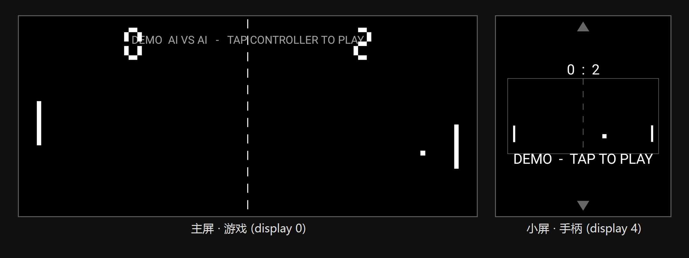

# Wing Pong — LG Wing 双屏编程 Demo

[](https://github.com/A0nameless0man/lg-wing-pong/actions/workflows/ci.yml)



为 LG Wing（旋盖双屏手机）编写的双屏 Pong：**大屏横屏打游戏，小屏就是手柄**。
本仓库同时是一份可运行的「LG Wing / 多 display Android 编程」参考实现——零第三方依赖，只用公开 API。

[English](#english)

## 玩法

| 屏幕 | 角色 |
|---|---|
| 主屏 (display 0, 1080×2460) | Pong 游戏画面，横屏，你 vs AI，11 分制 |
| 副屏 (display 4, 1080×1240) | 触控手柄：上下拖动控拍、点按发球/重开，镜像比分 |

- 启动后**自动**把手柄 Activity 推到小屏（`ActivityOptions.setLaunchDisplayId`）
- 控制器静置 10 秒进入 **DEMO 模式（AI vs AI 自动对打）**，小屏任意点按即刻接管
- **支持收起旋盖**：合上时副屏熄灭，自动切到大屏 only 模式（大屏触摸直接控拍）；
  重新展开恢复双屏分工（通过 `DisplayManager.DisplayListener` 监听副屏电源状态实现）
- 没有小屏的普通手机也能玩：手柄与游戏合并到同一屏（触摸左右半区）

## 双屏实现核心（20 行以内）

```java
// 1. 找到另一块非私有内建屏（Wing 副屏 = display 4）
for (Display d : displayManager.getDisplays()) { /* 排除 FLAG_PRIVATE / FLAG_PRESENTATION */ }

// 2. 把手柄 Activity 定向启动过去（公开 API，API 26+）
ActivityOptions opts = ActivityOptions.makeBasic();
opts.setLaunchDisplayId(target.getDisplayId());
startActivity(new Intent(this, ControllerActivity.class), opts.toBundle());
```

两个 Activity 运行在**同一进程**的不同 display 上，游戏状态放一个进程内单例
（`PongEngine`，归一化坐标 + 120Hz 固定步长物理），跨屏通信零 IPC、零延迟。

| 文件 | 职责 |
|---|---|
| `PongEngine.java` | 共享引擎：物理/AI/比分/attract 模式，两屏唯一状态源 |
| `GameActivity.java` | 大屏画面；含「小屏启动时自动迁移到大屏」逻辑 |
| `PongView.java` | Choreographer 渲染循环 + 七段数码管比分 |
| `ControllerActivity/View.java` | 小屏手柄：球场区域 1:1 触摸映射 + 比分镜像 |

## 在 LG Wing 上的已知门槛（踩坑记录）

- **小屏抽屉默认不显示第三方 app**。LG 在 ATMS 层用文件白名单把关：
  `设置 → 第二屏幕 → 应用程序` 打开本应用的开关即可（详见
  [docs/lg-wing-second-screen-notes.md](docs/lg-wing-second-screen-notes.md)，
  含反编译出的完整判定逻辑与文件路径）。
- 通过抽屉图标启动时 GameActivity 会落在小屏上，本 demo 会自动重定向到主屏
  （见 `GameActivity.redirectToBiggestInternalIfNeeded()`）。
- 大屏 `sensorLandscape` 在重定向后可能随机上下颠倒，已改为锁定 `landscape`。

## 构建

要求：JDK 17+、Android SDK Platform 33、Build-Tools 33.0.2（AGP 8.2.2 / Gradle 8.5）。

```bash
# local.properties 里配置 sdk.dir（或用 ANDROID_HOME 环境变量）
./gradlew assembleDebug
adb install -r app/build/outputs/apk/debug/app-debug.apk
```

## English

Wing Pong is a runnable demo of dual-display programming for the LG Wing:
the swiveled main display (1080×2460) hosts a classic Pong game while the
secondary display (1080×1240, hidden under the main one) acts as a touch
controller with a mirrored scoreboard. No third-party dependencies; only
public APIs — `ActivityOptions.setLaunchDisplayId()` plus a same-process
singleton (`PongEngine`) shared by two activities running on two displays.
After 10s of idle time the game enters an AI-vs-AI attract mode; any tap on
the controller takes over. Closing the swivel powers off the secondary panel
and the game automatically falls back to big-screen-only touch play
(detected via `DisplayManager.DisplayListener`). The repo also documents LG's
undocumented second-screen app whitelist (see
`docs/lg-wing-second-screen-notes.md`).

Build: JDK 17+, `./gradlew assembleDebug`, minSdk 26 / targetSdk 33.

## License

[MIT](LICENSE)
